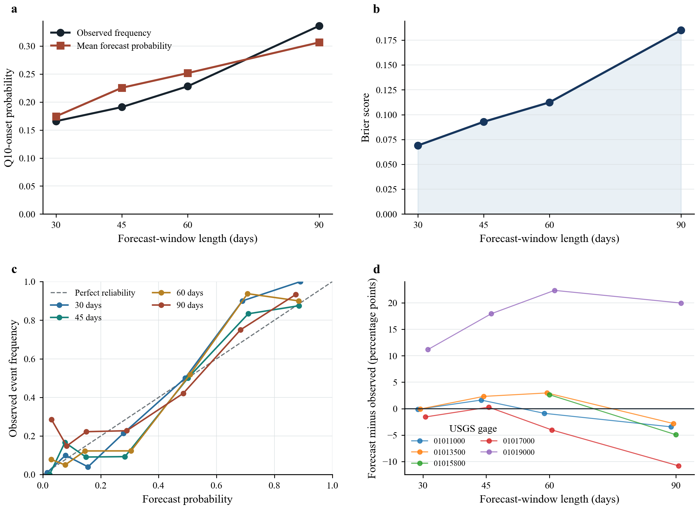
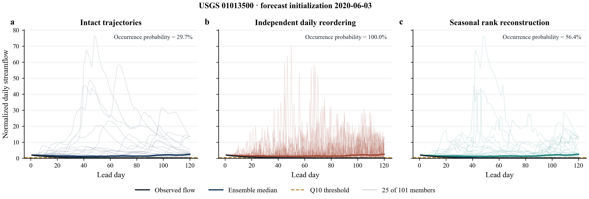

# Temporal Dependence Improves Probabilistic Forecasts of Low-Flow Events Across CONUS Catchments

Reproducible code and compact example data for the study:

> **Temporal Dependence Improves Probabilistic Forecasts of Low-Flow Events Across CONUS Catchments**

The study asks a narrow forecasting question: if the predictive distribution at
every future day is held fixed, how much do low-flow event forecasts change when
the connections among those days are removed or reconstructed? The analysis
evaluates Q10 low-flow occurrence, first-onset time, total low-flow-day count,
and cumulative deficit across thousands of CONUS catchments.

## What this repository provides

- A small, real-data example that runs in a few seconds.
- Two example figures: forecast verification and trajectory anatomy.
- The production scripts used for data preparation, forecasting, sensitivity
  analysis, public-data assembly, and publication figures.
- Frozen configuration files, data dictionaries, provenance notes, and tests.
- Clear separation between reusable code, small example data, external inputs,
  and generated outputs.

Raw USGS and GridMET archives are **not** duplicated here. They remain available
from their original providers. The `data/sample/` files are compact extracts and
figure-source data supplied only to verify installation and demonstrate the
workflow.

## Quick start

Python 3.10 or newer is recommended. From the repository root:

```bash
python -m venv .venv
source .venv/bin/activate
python -m pip install --upgrade pip
python -m pip install -e .
python scripts/run_sample_workflow.py
```

On Windows, activate the environment with `.venv\Scripts\activate`.

The sample run writes:

- `outputs/tables/sample_horizon_verification.csv`
- `outputs/tables/sample_basin_verification.csv`
- `outputs/tables/sample_reliability.csv`
- `outputs/tables/same_marginal_score_check.csv`
- `outputs/figures/sample_forecast_verification.png` and `.svg`
- `outputs/figures/sample_trajectory_anatomy.png` and `.svg`

Run the tests with:

```bash
python -m unittest discover -s tests
```

## Repository layout

```text
.
├── data/
│   ├── sample/          # Small real-data demonstration files tracked by Git
│   ├── external/        # Instructions for data obtained from USGS/GridMET
│   └── derived/         # Location for locally generated analysis products
├── docs/                # Methods, provenance, and full workflow documentation
├── outputs/             # Example tables and figures
├── scripts/             # Short, numbered sample workflow
├── src/lowflow_coherence/
│   ├── analysis.py      # Verification summaries and validation
│   ├── metrics.py       # Proper scores and skill calculations
│   └── plotting.py      # Reusable publication-style plotting functions
├── tests/               # Automated tests for metrics and the sample workflow
└── workflow/full_reproduction/
    ├── scripts/         # Matched discharge–meteorology preparation
    ├── lowflow_forecast_benchmark/  # Final 1–120-day forecast workflow
    ├── temporal_coherence_paper/    # Validation and data-release utilities
    └── figures/         # Final numbered figure entry points
```

The concise sample workflow is the best entry point for new users. The full
continental workflow is documented in
[`docs/full_reproduction.md`](docs/full_reproduction.md) and is intended for
users who have downloaded all external inputs and have substantial storage and
compute capacity.

## Reproducibility levels

1. **Installation check** — `python scripts/00_check_environment.py`
2. **Compact numerical reproduction** — `python scripts/run_sample_workflow.py`
3. **Full continental reproduction** — follow `docs/full_reproduction.md`
4. **Archived-result verification** — use the derived-data release described in
   `docs/data_availability.md`

The compact example does not reproduce continental estimates. It confirms that
the input schema, scoring calculations, same-marginal comparison, and plotting
code work on real archived records.

## Analysis-population accounting

The basin counts describe different stages or outcomes and should not be used
interchangeably. Observation-quality checks accepted 5,227 basins. A
preselected 192-basin development sample was excluded, so confirmation was
attempted in 5,035 basins. The original 1–90-day analysis produced at least one
valid score in 3,835 basins; the separately processed 120-day extension
produced at least one scorable threshold–target combination in 3,733 basins.
Those two counts are parallel results from the same confirmation population,
not consecutive filters. The primary Q10-onset cohort contains 3,402 basins.
All 3,402 have released records at every 30–120-day window, while the stricter
score sample varies by window according to the `lead_is_scorable` flag (3,333
basins and 428,955 initialization records at 120 days).

## Example output





## Scientific boundaries

- These are retrospective forecasts evaluated from 2016 through 2025, not an
  operational forecast service.
- Q10 is the lower 10th percentile in each basin (Q90 in exceedance notation).
- The historical `duration` fields count all low-flow days in a window; they do
  not isolate one uninterrupted drought episode.
- The trajectory experiment holds daily predictive distributions fixed and
  changes only cross-day member continuity.
- Skill varies by event property, forecast-window length, and region.
- Historical dependence reconstruction does not replace future meteorological
  forcing or regional calibration.

## Citation

Cite this repository using `CITATION.cff`. The complete derived dataset is
archived in Zenodo at https://doi.org/10.5281/zenodo.22770792. The deposit
contents and verification procedure are documented in
[`docs/zenodo_deposit.md`](docs/zenodo_deposit.md).

## Licensing

Code is released under the MIT License. The small derived example data are
released under CC BY 4.0; see `LICENSE-DATA.md`. Original USGS and GridMET data
remain subject to the terms and citation guidance of their providers.

Article text, authoring code, submission utilities, editorial correspondence,
and discarded experiments are intentionally excluded from this repository.

## Contact

Amobichukwu C. Amanambu  
Department of Geography and the Environment, The University of Alabama  
acamanambu@ua.edu
