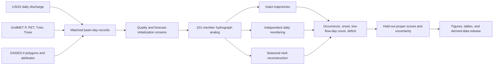

# Workflow overview

The repository separates a fast demonstration from the continental research
workflow. This prevents a new user from having to download hundreds of
gigabytes before verifying that the code and environment work.

## Chronological separation

- Model fitting: 1 January 1980–31 December 2009.
- Configuration/calibration: 1 January 2010–31 December 2015.
- Held-out evaluation: 1 January 2016–31 December 2025.
- Basin-specific Q10 thresholds: estimated using data through 2015.

## Central controlled comparison

The intact, independently reordered, and seasonally reconstructed forecasts
contain the same 101 values on every future day. Only the association of
ensemble members across days changes. Therefore, differences in path-based
event scores are attributable to temporal dependence rather than changes in
daily means, quantiles, spreads, or threshold probabilities.

## Forecast quantities

- **Occurrence:** whether flow crosses Q10 at least once in the window.
- **First onset:** the first day on which flow crosses Q10.
- **Low-flow-day count:** the total number of days at or below Q10 in the
  window; this is not the duration of one uninterrupted drought episode.
- **Cumulative deficit:** summed shortfall below Q10.
- **Minimum flow:** lowest flow in the window, retained as a boundary test.

All quantities are evaluated member by member before forming predictive
distributions. See `methods.md` for the score definitions and
`full_reproduction.md` for the production run order.
